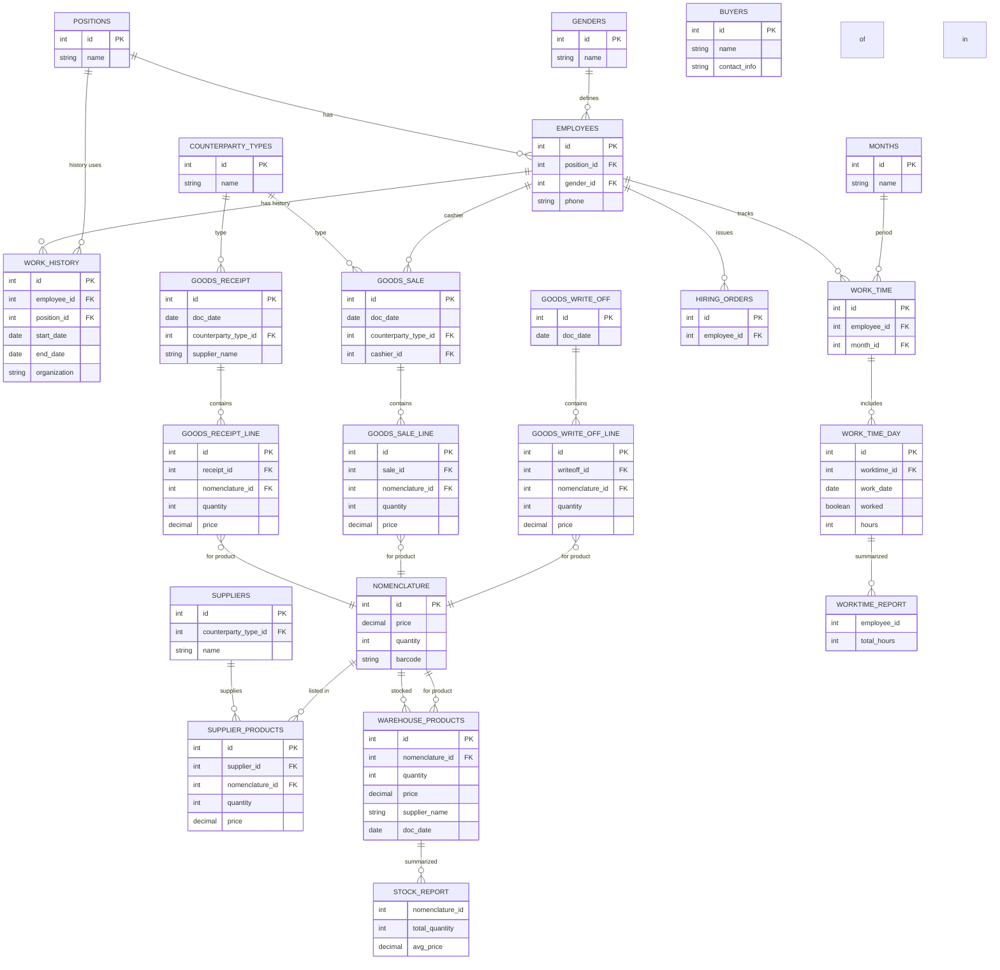

```mermaid
erDiagram
    %% Справочники и перечисления
    POSITIONS {
        int id PK
        string name
    }
    GENDERS {
        int id PK
        string name
    }
    COUNTERPARTY_TYPES {
        int id PK
        string name
    }
    MONTHS {
        int id PK
        string name
    }
    EMPLOYEES {
        int id PK
        int position_id FK
        int gender_id FK
        string phone
    }
    WORK_HISTORY {
        int id PK
        int employee_id FK
        int position_id FK
        date start_date
        date end_date
        string organization
    }
    NOMENCLATURE {
        int id PK
        decimal price
        int quantity
        string barcode
    }
    SUPPLIERS {
        int id PK
        int counterparty_type_id FK
        string name
    }
    SUPPLIER_PRODUCTS {
        int id PK
        int supplier_id FK
        int nomenclature_id FK
        int quantity
        decimal price
    }
    BUYERS {
        int id PK
        string name
        string contact_info
    }

    %% Документы
    GOODS_RECEIPT {
        int id PK
        date doc_date
        int counterparty_type_id FK
        string supplier_name
    }
    GOODS_RECEIPT_LINE {
        int id PK
        int receipt_id FK
        int nomenclature_id FK
        int quantity
        decimal price
    }
    GOODS_SALE {
        int id PK
        date doc_date
        int counterparty_type_id FK
        int cashier_id FK
    }
    GOODS_SALE_LINE {
        int id PK
        int sale_id FK
        int nomenclature_id FK
        int quantity
        decimal price
    }
    GOODS_WRITE_OFF {
        int id PK
        date doc_date
    }
    GOODS_WRITE_OFF_LINE {
        int id PK
        int writeoff_id FK
        int nomenclature_id FK
        int quantity
        decimal price
    }
    HIRING_ORDERS {
        int id PK
        int employee_id FK
    }
    WORK_TIME {
        int id PK
        int employee_id FK
        int month_id FK
    }
    WORK_TIME_DAY {
        int id PK
        int worktime_id FK
        date work_date
        boolean worked
        int hours
    }

    %% Регистр накопления
    WAREHOUSE_PRODUCTS {
        int id PK
        int nomenclature_id FK
        int quantity
        decimal price
        string supplier_name
        date doc_date
    }

    %% Отчёты (представления)
    STOCK_REPORT {
        int nomenclature_id
        int total_quantity
        decimal avg_price
    }
    WORKTIME_REPORT {
        int employee_id
        int total_hours
    }

    %% Связи
    POSITIONS ||--o{ EMPLOYEES       : has
    GENDERS   ||--o{ EMPLOYEES       : defines
    EMPLOYEES ||--o{ WORK_HISTORY    : "has history"
    POSITIONS ||--o{ WORK_HISTORY    : "history uses"
    SUPPLIERS ||--o{ SUPPLIER_PRODUCTS : supplies
    NOMENCLATURE ||--o{ SUPPLIER_PRODUCTS : "listed in"
    GOODS_RECEIPT ||--o{ GOODS_RECEIPT_LINE : contains
    GOODS_RECEIPT_LINE }o--|| NOMENCLATURE    : "for product"
    COUNTERPARTY_TYPES ||--o{ GOODS_RECEIPT : type of
    GOODS_SALE    ||--o{ GOODS_SALE_LINE    : contains
    GOODS_SALE_LINE }o--|| NOMENCLATURE      : "for product"
    COUNTERPARTY_TYPES ||--o{ GOODS_SALE   : type of
    EMPLOYEES    ||--o{ GOODS_SALE       : cashier
    GOODS_WRITE_OFF ||--o{ GOODS_WRITE_OFF_LINE : contains
    GOODS_WRITE_OFF_LINE }o--|| NOMENCLATURE : "for product"
    EMPLOYEES ||--o{ HIRING_ORDERS    : issues
    EMPLOYEES ||--o{ WORK_TIME        : tracks
    MONTHS    ||--o{ WORK_TIME        : period
    WORK_TIME ||--o{ WORK_TIME_DAY    : includes
    NOMENCLATURE ||--o{ WAREHOUSE_PRODUCTS : stocked
    WAREHOUSE_PRODUCTS }o--|| NOMENCLATURE : "for product"
    WAREHOUSE_PRODUCTS ||--o{ STOCK_REPORT : summarized in
    WORK_TIME_DAY ||--o{ WORKTIME_REPORT : summarized in

```