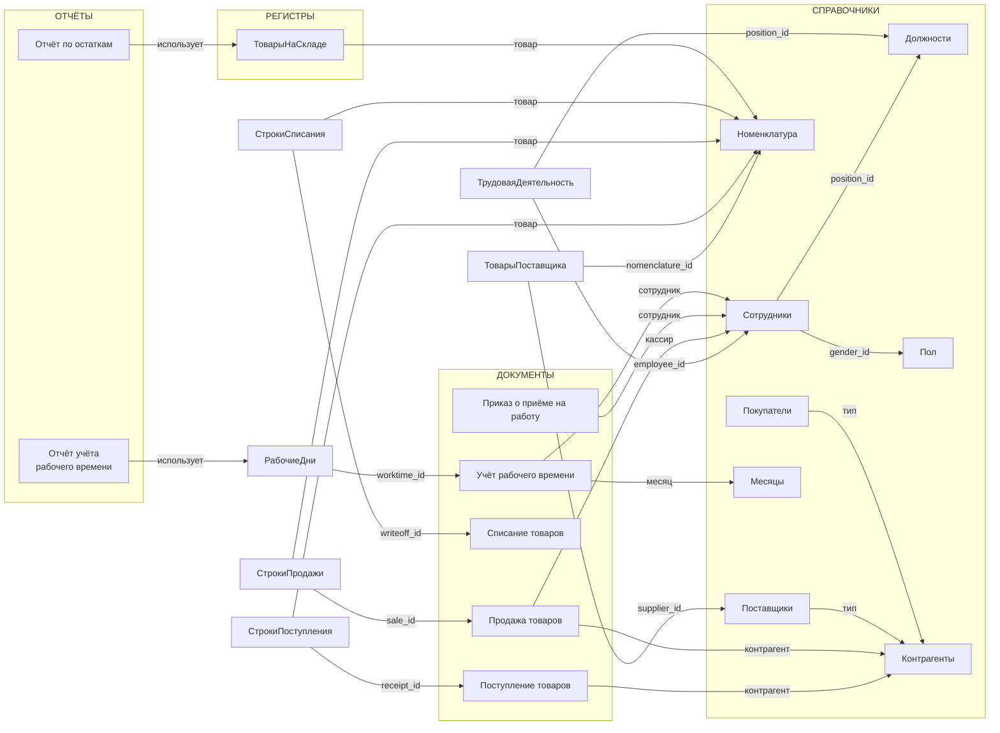

```mermaid
graph LR
  %% ======== Справочники ========
  subgraph СПРАВОЧНИКИ
    direction TB
    Emp[Сотрудники]
    Nom[Номенклатура]
    Sup[Поставщики]
    Buy[Покупатели]
    Pos[Должности]
    Gen[Пол]
    Ctp[Контрагенты]
    Mon[Месяцы]
  end

  %% ======== Табличные части справочников ========
  EmpWH[ТрудоваяДеятельность]
  SupProd[ТоварыПоставщика]

  %% ======== Документы ========
  subgraph ДОКУМЕНТЫ
    direction TB
    GR[Поступление товаров]
    GS[Продажа товаров]
    GW[Списание товаров]
    HO[Приказ о приёме на работу]
    WT[Учёт рабочего времени]
  end

  %% ======== Табличные части документов ========
  GRL[СтрокиПоступления]
  GSL[СтрокиПродажи]
  GWL[СтрокиСписания]
  WTD[РабочиеДни]

  %% ======== Регистр накопления ========
  subgraph РЕГИСТРЫ
    direction TB
    WP[ТоварыНаСкладе]
  end

  %% ======== Отчёты ========
  subgraph ОТЧЁТЫ
    direction TB
    SR[Отчёт по остаткам]
    WTR[Отчёт учёта\nрабочего времени]
  end

  %% ======== Связи справочников ========
  Emp -->|position_id| Pos
  Emp -->|gender_id| Gen
  EmpWH -->|employee_id| Emp
  EmpWH -->|position_id| Pos

  SupProd -->|supplier_id| Sup
  SupProd -->|nomenclature_id| Nom

  %% ======== Связи документов ========
  GR -->|контрагент| Ctp
  GRL -->|receipt_id| GR
  GRL -->|товар| Nom

  GS -->|контрагент| Ctp
  GS -->|кассир| Emp
  GSL -->|sale_id| GS
  GSL -->|товар| Nom

  GWL -->|writeoff_id| GW
  GWL -->|товар| Nom

  HO -->|сотрудник| Emp

  WT -->|сотрудник| Emp
  WT -->|месяц| Mon
  WTD -->|worktime_id| WT

  %% ======== Связи регистра ========
  WP -->|товар| Nom

  %% ======== Связи отчётов ========
  SR -->|использует| WP
  WTR -->|использует| WTD

  %% ======== Доп. связи ========
  Sup -->|тип| Ctp
  Buy -->|тип| Ctp

```