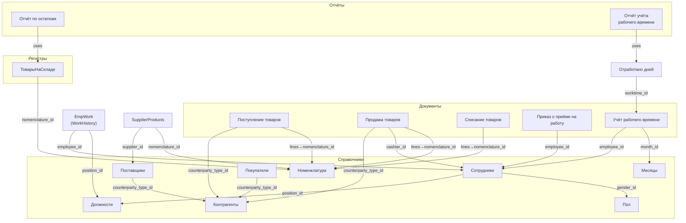

```mermaid
graph TD
  %% Подграфы для группировки
  subgraph Справочники
    Emp["Сотрудники"]
    Nom["Номенклатура"]
    Sup["Поставщики"]
    Buy["Покупатели"]
    Pos["Должности"]
    Gen["Пол"]
    Ctp["Контрагенты"]
    Mon["Месяцы"]
  end

  subgraph Документы
    GR["Поступление товаров"]
    GS["Продажа товаров"]
    GW["Списание товаров"]
    HO["Приказ о приёме на работу"]
    WT["Учёт рабочего времени"]
  end

  subgraph Регистры
    WP["ТоварыНаСкладе"]
  end

  subgraph Отчёты
    SR["Отчёт по остаткам"]
    WTR["Отчёт учёта\nрабочего времени"]
  end

  %% Связи внутри справочников
  Emp -->|position_id| Pos
  Emp -->|gender_id| Gen
  EmpWork["EmpWork\n(WorkHistory)"] -->|employee_id| Emp
  EmpWork -->|position_id| Pos

  SupProd["SupplierProducts"] -->|supplier_id| Sup
  SupProd -->|nomenclature_id| Nom

  %% Связи документов со справочниками
  GR -->|counterparty_type_id| Ctp
  GR -->|lines→nomenclature_id| Nom

  GS -->|counterparty_type_id| Ctp
  GS -->|cashier_id| Emp
  GS -->|lines→nomenclature_id| Nom

  GW -->|lines→nomenclature_id| Nom

  HO -->|employee_id| Emp

  WT -->|employee_id| Emp
  WT -->|month_id| Mon
  WTDay["Отработано дней"] -->|worktime_id| WT

  %% Связи регистра накопления
  WP -->|nomenclature_id| Nom

  %% Связи отчётов
  SR -->|uses| WP
  WTR -->|uses| WTDay

  %% Дополнительные связи (опционально)
  Sup -->|counterparty_type_id| Ctp
  Buy -->|counterparty_type_id| Ctp

```